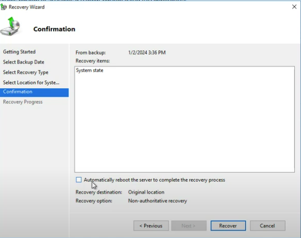
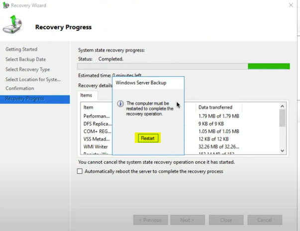
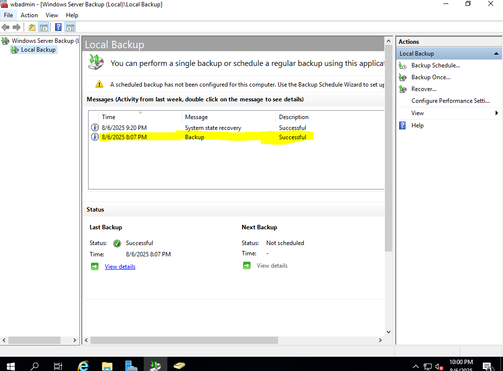

# Windows-Sever-Backup-Restore

🖥️ Windows Server System Backup and Restore – Practical Summary
This project shows how to create a system backup of a Windows Server and how to restore it later when needed.

✅ What I did:
Took a System Backup (includes system state and essential system files).

Used the Windows Server Backup tool to create the backup.

Saved the backup to a different drive or location.

Planned to restore the server's system using this backup (for recovery purposes).

🎯 Purpose:
To show how to protect the Windows Server system using backup and restore in case of failures or system issues.

## Steps 

1. In this screenshot, I created some users. Later, I will delete them and then restore the system to bring them back.
   
  

2. Click on "Add Roles and Features" to install the Windows Server Backup feature.

  

3. In the Features section, check the Windows Server Backup option, then click Next and proceed with the installation. Once the installation is complete, go to the Tools menu. At the bottom, you will find Windows Server Backup click on it to open.

   

4.Now, click on Local Backup. You will see two options: Backup Schedule (used to configure daily backups) and Backup Once (used for a one-time manual backup). In this practical, I will perform a Backup Once operation.

   

5. Click on Backup Once, then select the Custom option and click Next to proceed.

   

6. Click on Add Items to select the components you want to include in the backup

   

7. Select System State, as this backup will include Active Directory and other essential system services.
   

8. I am going to store the backup on the E: drive, but you can choose any location based on your requirements.

   

9. Now, select your destination drive and click Next to continue.

    

10. On the Confirmation page, click Backup to start the process.

    

11. You can now see that the system backup process has started.

    

12. The system backup has been completed successfully.

    

13. You can see that the backup has been successfully saved to the E: drive.

    

14. Now that the backup is complete, we will delete the users we created earlier. After that, we will proceed with the restoration to recover them.

    

15. Now, open Windows Server Backup and click on Recover to begin the restoration process. 

  

16. To recover the system backup, we must boot into Directory Services Restore Mode (DSRM); otherwise, an error will occur during the restoration process.

🛠️ What is DSRM (Directory Services Restore Mode)?
DSRM (Directory Services Restore Mode) is a special boot mode in Windows Server used for performing maintenance or recovery tasks related to Active Directory.

🔍 Why is DSRM used?
It temporarily disables Active Directory so you can safely perform tasks like:

Restoring system state (e.g., from a backup)

Repairing or recovering Active Directory

Troubleshooting domain controller issues
    

17. To enter DSRM mode, press Windows + R, type msconfig, and press Enter.

    

18. Then, go to the Boot tab, check the Safe boot option, and select Active Directory repair. After that, click Apply, then OK.

    

19. Your system will now restart and boot into Directory Services Restore Mode (DSRM).

    

20. While in DSRM mode, open Windows Server Backup, and click on Recover to begin the restoration process.

    

21. Click Next

    

22. Select the date and time when the backup was created.

    

23. Now, select the type of backup you want to restore. In this case, I am restoring the System State backup.

    

24. Click Next then OK

    

    

25. Now, click on Recover to start the restoration process.

    

26. You can now see that the data recovery process has started.

    

27. Once the recovery is complete, restart your system and exit DSRM mode by following the same steps in msconfig, but this time uncheck Safe boot, then click Apply and OK.

    

28. You can now see that the users we previously deleted have been successfully restored.

    

29. All data has been successfully restored.

    
